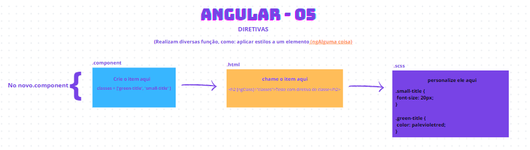

# estudosAngular
Repositório criado para auxiliar (com resumos) no grupo de estudos de angular.

# Angular aula 01 - sobre o angular
Verificamos o básico sobre o angular: como funciona, como trabalha - diferenças de frameworks vs bibliotecas, é uma linguagem de programação? 

# Angular aula 02 - componentes
Como que funciona trabalhar com componentes no angular e também, as mudanças que tiveram da última versão - ex: standalone. 
Vídeo pra entender melhor: <https://www.youtube.com/watch?v=rOYzrYLyy_4>
Recomendo fortemente a explorar essas duas formas de trabalhar (versão antiga e atual - 17). 

# Angular aula 03 - interpolação de dados
Neste módulo vimos de que forma podemos trabalhar com informações de objetos, listas e variáveis entre os componentes, como também o estilo deles (sccs/css).

# Angular aula 04 - compartilhamento de dados
Aqui começamos a de fato trabalhar com aquilo que é de fato muito importante para o dia a dia de quem trabalha com angular. Para isso, trouxe uma outra referência para treinarmos mais essa parte. (https://dfealves.medium.com/angular-compartilhando-dados-entre-componentes-4287f44f2a5f)
**Lembrem-se: ler documentação é uma boa prática aos devs, pois te ajuda a entender melhor assim como, te ensina a ter/fazer uma boa documentação.

# Angular aula 05 - directives
As diretivas realizam diversas funções, umaa delas: aplicar estilos a um elemento. Você também pode conferir e praticar mais por esse link (https://andrewrosario.medium.com/dominando-as-diretivas-estruturais-no-angular-c1860dbe8b82)

